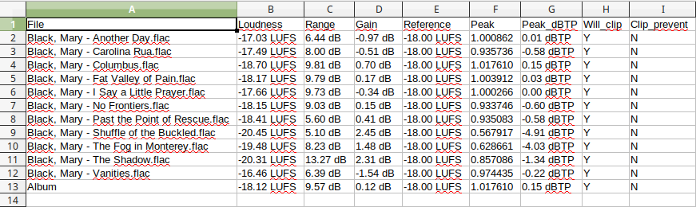
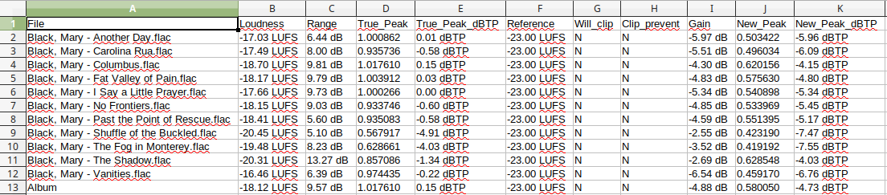

# loudgain

**loudgain** is a versatile ReplayGain 2.0 loudness normalizer, based on the EBU R128/ITU BS.1770 standard (-18 LUFS) and supports FLAC/Ogg/MP3 audio files. It uses the well-known `mp3gain` commandline syntax.

Just what you ever wanted: The best of mp3gain, ReplayGain 2.0 and Linux combined. **Spread the word!**

---

## Table of Contents

<!-- MDTOC maxdepth:6 firsth1:2 numbering:0 flatten:0 bullets:1 updateOnSave:1 -->

- [Table of Contents](#table-of-contents)   
- [MAIN FEATURES](#main-features)   
- [NEWS, CHANGELOG](#news-changelog)   
- [GETTING STARTED](#getting-started)   
- [DEPENDENCIES](#dependencies)   
- [BUILDING](#building)   
- [TECHNICAL DETAILS (advanced users stuff)](#technical-details-advanced-users-stuff)   
   - [Things in the `bin`folder](#things-in-the-binfolder)   
      - [rgbpm.sh – Folder-based loudness and BPM scanning](#rgbpmsh-–-folder-based-loudness-and-bpm-scanning)   
      - [loudgain.static](#loudgainstatic)   
   - [Uppercase or lowercase 'REPLAYGAIN_*' tags?](#uppercase-or-lowercase-replaygain_-tags)   
   - [Tags written (and/or deleted)](#tags-written-andor-deleted)   
      - [Default mode `-s i` (`--tag-mode i`)](#default-mode-s-i-tag-mode-i)   
      - [Enhanced mode `-s e` (`--tag-mode e`)](#enhanced-mode-s-e-tag-mode-e)   
      - ["LU" units mode `-s l` (`--tag-mode l`)](#lu-units-mode-s-l-tag-mode-l)   
   - [Track and Album Peak](#track-and-album-peak)   
   - [MP3 ID3v2.3, ID3v2.4, and APE tags](#mp3-id3v23-id3v24-and-ape-tags)   
      - [Force writing ID3v2.3 or ID3v2.4 tags](#force-writing-id3v23-or-id3v24-tags)   
      - [Strip unwanted ID3v1/APEv2 tags `-S` (`--striptags`)](#strip-unwanted-id3v1apev2-tags-s-striptags)   
   - [Analyze audio files and output to CSV](#analyze-audio-files-and-output-to-csv)   
      - [Example: Mary Black’s album »No Frontiers« (1989)](#example-mary-black’s-album-»no-frontiers«-1989)   
      - [Write a simple analysis to a CSV file](#write-a-simple-analysis-to-a-csv-file)   
      - [Analyze again, using clipping prevention](#analyze-again-using-clipping-prevention)   
      - [Just for fun: What if we _really_ followed the EBU R128 recommendation?](#just-for-fun-what-if-we-_really_-followed-the-ebu-r128-recommendation)   
      - [Time to save the tags and listen to the music!](#time-to-save-the-tags-and-listen-to-the-music)   
   - [Clipping prevention](#clipping-prevention)   
   - [Here be dragons: A word on MP3 files and ID3 tags](#here-be-dragons-a-word-on-mp3-files-and-id3-tags)   
      - [Some basic recommendations](#some-basic-recommendations)   
      - [A zillion ways to store loudness/gaining information](#a-zillion-ways-to-store-loudnessgaining-information)   
      - [Character encoding, or: Why does my smørrebrød look like "smørrebrød"?](#character-encoding-or-why-does-my-smørrebrød-look-like-smã¸rrebrã¸d)   
- [loudgain makes it easy following the »Gold Standard«](#loudgain-makes-it-easy-following-the-»gold-standard«)   
- [AUTHORS](#authors)   
- [COPYRIGHT](#copyright)   

<!-- /MDTOC -->

---

## MAIN FEATURES

**loudgain** is a loudness normalizer that scans music files and calculates
loudness-normalized gain and loudness peak values according to the EBU R128
standard, and can optionally write ReplayGain-compatible metadata.

[EBU R128](https://tech.ebu.ch/loudness) is a set of recommendations regarding
loudness normalisation based on the algorithms to measure audio loudness and
true-peak audio level defined in the
[ITU BS.1770](http://www.itu.int/rec/R-REC-BS.1770/en) standard, and is used in
the (currently under construction) [ReplayGain 2.0 specification](https://wiki.hydrogenaud.io/index.php?title=ReplayGain_2.0_specification).

loudgain implements a subset of mp3gain's command-line options, which means that
it can be used as a drop-in replacement in some situations.

**Note:** loudgain will _not_ modify the actual audio data, but instead just
write ReplayGain _tags_ if so requested. It is up to the player to interpret
these. (_Hint:_ In some players, you need to enable this feature.)

**Note:** loudgain can be used instead of `mp3gain`, `vorbisgain` and `metaflac`
in order to write ReplayGain 2.0 compatible loudness tags into MP3, Ogg Vorbis
and FLAC files, respectively.

**Note:** EBU R128 recommends a program (integrated) target loudness of -23 LUFS
and uses _LU_ and _LUFS_ units. The proposed ReplayGain 2.0 standard tries to
stay compatible with older software and thus uses EBU R128 loudness measuring
_but_ at a target of -18 LUFS (estimated to be equal to the old "89 dB" reference
loudness). The generated tags also still use the "dB" suffix (except for '-s l'
tag-mode which uses "LU"; 1 dB = 1 LU).

loudgain defaults to the ReplayGain 2.0 standard (-18 LUFS, "dB" units,
uppercase tags). Peak values are measured using the True Peak algorithm.

**Standing on the shoulders of giants:** loudgain wouldn’t be possible without Linux and the fantastic [`taglib`](https://github.com/taglib/taglib) and [`libebur128`](https://github.com/jiixyj/libebur128) libraries. Thank you!

Also my heartfelt thanks to _Alessandro Ghedini_ who had the original idea back in 2014 and gave us his [v0.1 repo](https://github.com/ghedo/loudgain) from which I forked. (Want a PR?)

---

## NEWS, CHANGELOG

**2019-07-17** — **v0.3.2** released:
  * Work around [bug #913 in taglib](https://github.com/taglib/taglib/issues/913): If both APEv2 and ID3v1 tags present and due to be stripped, sometimes ID3v1 tags would be left over.

**2019-07-17** — **v0.3.1** released:
  * "Delete tags" `-s d` (`--tagmode=d`) now respects "strip" `-S` (`--striptags`) and "ID3v2 version" `-I` (`--id3v2version`) settings for MP3 files. Thus, when removing ReplayGain tags, unwanted tag types like ID3v1 or APE can also be removed, and the the resultant ID3v2 tag version be specified.

**2019-07-13** — **v0.3.0** released:
  * Much better clipping prevention logic.
  * Breaking change: Some long options slightly renamed.
  * Breaking change: `-k` now obeys EBU -1 dBTP maximum true peak level (as opposed to 0 dBTP before). Read [Clipping prevention](#clipping-prevention).
  * New option `-K n` (`--maxtpl=n`) switches on clipping prevention like `-k` and allows manually setting the max. true peak level (i.e., `-K 0` to limit at digital full scale, or `-K -2` if later processing includes lossy encoding).
  * Breaking change: Reordered and extended `-O` (`--output-new`) output. It now adds the fields `New_Peak` and `New_Peak_dBTP` so one can see what will happen in the playout/post-processing chain after the replay gain has been applied. Read [Analyze audio files and output to CSV](#analyze-audio-files-and-output-to-csv).

**2019-07-12** — Temporary solution to the taglib problem:
* If you need to loudgain _Ogg Vorbis_ files, you can use the provided `loudgain.static` in the `bin/` folder. I have built it against _taglib 1.11.1-3_ on Manjaro, a version that doesn’t show the bug. Read [loudgain.static](#loudgainstatic).

**2019-07-10** — **Warning:**
* There seems to be an open [bug](https://github.com/taglib/taglib/issues/864) in `taglib` (which loudgain uses) that also affects lots of other programs: Upon writing _Ogg Vorbis_ files, they can possibly get corrupted.

  **I advise _not_ to save tags to Ogg Vorbis files right now, until this issue is resolved upstream and you can compile a bugfree taglib or the distros provide one!**

  Analyzing Ogg files is fine, as well as analyzing and saving to MP3 and FLAC.

**2019-07-10** — **v0.2.7** released:
* Add option to strip ID3v1/APEv2 tags from MP3 files: `-S` (`--striptags`).
* Add option to select between ID3v2.3 & ID3v2.4 for MP3 files: `-I 3` (`--id3v2version 3`).
* Much more technical documentation here.
* Great new tab-delimited list output format: `-O` (`--output-new`). For a usage example, read [Analyze audio files and output to CSV](#analyze-audio-files-and-output-to-csv).

**2019-07-09** — **v0.2.6** released:
* Reverted back to default uppercase `REPLAYGAIN_*` tags in MP3 files. The ReplayGain 2.0 spec requires this.
* Added `-L` (`--lowercase`) option for those who _need_ lowercase `replaygain_*` tags (MP3/IDv2 _only_; doesn’t affect FLAC/Ogg). Read [Uppercase or lowercase 'REPLAYGAIN_*' tags?](#uppercase-or-lowercase-replaygain_-tags).

**2019-07-08** — **v0.2.5** released:
* Clipping warning & clipping prevention (`-k`) now work correctly, for both track and album.

**2019-07-08** — **v0.2.4** and **v0.2.4-1** released:
* Add "extra tags" mode `-s e` (`--tag-mode e`). Writes `REPLAYGAIN_REFERENCE_LOUDNESS`, `REPLAYGAIN_TRACK_RANGE` and `REPLAYGAIN_ALBUM_RANGE` tags (same that [`bs1770gain`](https://github.com/petterreinholdtsen/bs1770gain) uses).
* Add "LU" units mode `ss l` (`--tag-mode l`). Like above but uses "LU" instead of "dB" units in the tags.
* Update README.md and program help.

**2019-07-07** — **v0.2.3** released:
*  Fix broken album peak (again).
* MP3/ID3v2 now get _lowercase_ `replaygain_*` tags.
* Better versioning.

**2019-07-07** — **v0.2.2** released:
* Fixed album peak calculation.
* Write `REPLAYGAIN_ALBUM_*` tags only when in album mode.
* Better versioning (`CMakeLists.txt` → `config.h`).
* **TODO:** Clipping calculations still wrong.

**2019-06-30** — **v0.2.1** released:
* Added version and `-v` (`--version`) option.
* Added writing tags to Ogg Vorbis files (now supports MP3, FLAC, Ogg Vorbis).
* Always remove `REPLAYGAIN_REFERENCE_LOUDNESS`, wrong value might confuse players.
* Added notice in help on which file types can be written.
* Added album summary in output.

**2019-06** – v0.1 (2014-06-13) forked from https://github.com/ghedo/loudgain.

---

## GETTING STARTED

loudgain is (mostly) compatible with mp3gain's command-line arguments (the `-r`
option is always implied). Here are a few examples:

```bash
$ loudgain *.mp3                       # scan some mp3 files without tagging
$ loudgain -s i *.mp3                  # scan and tag some mp3 files with ReplayGain 2.0 tags
$ loudgain -d 13 -k *.mp3              # add a pre-amp gain and prevent clipping
$ loudgain -s d *.mp3                  # remove ReplayGain tags from the files
$ loudgain -a -s i *.flac              # scan & tag an album of FLAC files
$ loudgain -a -s e *.flac              # scan & tag an album of FLAC files, add extra tags (reference, ranges)
$ loudgain -d -5 -a -s l *.flac        # apply -5 LU pregain to reach -23 LUFS target for EBU compatibility, add reference & range information, use 'LU' units in tags
$ loudgain -I 3 -S -L -a -k -s e *.mp3 # scan & tag an MP3 album, recommended settings
```

See the [man page](docs/loudgain.1.md) for more information.  
See [loudgain makes it easy following the »Gold Standard«](#loudgain-makes-it-easy-following-the-gold-standard) for quickstart recommended settings.

---

## DEPENDENCIES

 * `libavcodec`
 * `libavformat`
 * `libavutil`
 * `libebur128` (v1.2.4+ recommended)
 * `libtag`

 On Ubuntu 18.04/Linux Mint 19.1, you can usually install CMake and the needed libraries using
 ```bash
 sudo apt-get install cmake libavcodec-dev libavformat-dev libavutil-dev libebur128-dev libtag1-dev
 ```

---

## BUILDING

loudgain is distributed as source code. Install with:

```bash
$ mkdir build && cd build
$ cmake ..
$ make
$ [sudo] make install
```

If you modified [docs/loudgain.1.md](docs/loudgain.1.md) (the man page source), get `ronn`, move to the `docs/` folder and type:

```bash
$ ronn loudgain.1.md
```

This will generate new `loudgain.1` and `loudgain.1.html` files (man page and readable HTML, respectively).

If you need to recreate `bin/loudgain.static`, get [staticx](https://github.com/JonathonReinhart/staticx), install loudgain on your system, move to the `bin/` folder and type:

```bash
$ staticx --strip `which loudgain` loudgain.static
$ ln -s loudgain.static loudgain
```

You can then move `loudgain` and `loudgain.static` to your target user’s `~/bin` folder.

Beware this is a kludge only to be used if all else fails. (For example, you _can_ build on Ubuntu 18.04/Linux Mint 19 but really _need_ loudgain to work on Ubuntu 14.04/Linux Mint 17.3. That’s what I used it for.)

---

## TECHNICAL DETAILS (advanced users stuff)

Not an expert? **Don’t worry, loudgain comes with sensible default settings.** You might never need the "special options".

But _if_ you do, you might need them badly. Welcome to the expert sessions—read on!

### Things in the `bin`folder

These are meant for testing, and to get you going FAST.
You can simply copy these files into your user’s `$HOME/bin` folder and make them executable. On most Linuxes, they should be available as commands in the path when opening the next shell. Maybe you need to log off and back on again to make it work.

#### rgbpm.sh – Folder-based loudness and BPM scanning

This is a little bash script to invoke loudgain (well, and a BPM scanner) and have it scan album folders, starting from a top folder, recursively. I use this almost every day.

```bash
$ rgbpm.sh folder [...]
```

Please study the code and adapt as needed for _your_ situation.

#### loudgain.static

This is a horrible kludge, really. A prebuilt statically-linked runnable version of loudgain _only_ to be used if you really really have no other option (i.e., needed libraries uncompilable under older Linuxes).

It’s a 64-bit ELF made using [staticx](https://github.com/JonathonReinhart/staticx) that brings the needed libraries with it. I tested it with Ubuntu versions 14.04–18.04, Linux Mint 17.3–19.1, and Manjaro 18.0.4. It works but it’s _slooow_ to start.

If you don’t have a "real" `loudgain`, you can create a symlink to it in your `~/bin` directory as follows (assuming you have copied `loudgain.static` to there):
```bash
$ cd ~/bin
$ ln -s loudgain.static loudgain
```

Verify that it’s available as a normal command by trying either of the following:
```bash
$ which loudgain
$ loudgain -h
```

### Uppercase or lowercase 'REPLAYGAIN_*' tags?

This has been a problem ever since, most notably in MP3 ID3v2 tags, because these are case-sensitive. FLAC and Ogg Vorbis use Vorbis Comments to store tags, these can be upper-, lower- or mixed case per definition and MUST be treated equal.

The ReplayGain 1 and 2.0 specs clearly state that the tags should be UPPERCASE but many taggers still write lowercase tags (foobar2000, metamp3, taggers using pre-1.2.2 Mutagen like older MusicBrainz Picard versions, and others).

Unfortunately, there are lots of audio players out there that only respect _one_ case. For instance, VLC only respects uppercase (_Edit: This seems to chave changed in versions 3.x._), IDJC only respects lowercase. Only a very few go the extra effort to check for both variants of tags.

It seems that out in the field, there are more players that respect the lowercase tags than players respecting the uppercase variant, maybe due to the fact that the majority of MP3s seem to be tagged using the lowercase ReplayGain tags—they simply adopted.

Now all this can lead to lots of problems and seems to be an unsolvable issue. In my opinion, _all_ players should respect _all_ variants of tags.

Since we don’t live in an ideal world, my approach to the problem is as follows:

1. loudgain uses the ReplayGain 2.0 "standard" as its default, in order not to confuse newbies. (That means: -18 LUFS reference, "dB" units, and uppercase 'REPLAYGAIN_*' tags.)

2. Upon deleting ReplayGain tags (using `-s d` or before writing new tags using `-s i`, `-s e` or `-s l`), loudgain will delete _all_ variants of the old tags. Thus, if you have like (may be due to mis-tagging):
    ```
    REPLAYGAIN_TRACK_GAIN -7.02 dB
    replaygain_track_gain -7.50 dB
    ```
    loudgain will remove _both_ then write _one_ new tag (of each sort), usually like:
    ```
    REPLAYGAIN_TRACK_GAIN -7.02 dB
    ```

3. For the seemingly unavoidable cases where you _do_ indeed need lowercase ReplayGain tags in MP3 ID3v2 tags, I introduced a new option `-L` (`--lowercase`) that will _force_ writing the lowercase variant (but _only_ in MP3 ID3v2; FLAC and Ogg Vorbis will still get standard uppercase tags):
    ```
    replaygain_track_gain -7.02 dB
    ```

### Tags written (and/or deleted)

#### Default mode `-s i` (`--tag-mode i`)

In its simplest, mp3gain-compatible, tag writing mode `-s i` (`--tag-mode i`), loudgain will only produce the bare minimum required by the ReplayGain 2.0 standard:
```
REPLAYGAIN_TRACK_GAIN [-]a.bb dB
REPLAYGAIN_TRACK_PEAK c.dddddd
```

If "album mode" `-a` is specified, these additional album tags will be produced:
```
REPLAYGAIN_ALBUM_GAIN [-]a.bb dB
REPLAYGAIN_ALBUM_PEAK c.dddddd
```

All other known ReplayGain tags (no matter what case) will be _deleted_, in order not to confuse other software. These are (if present):
```
REPLAYGAIN_TRACK_GAIN
REPLAYGAIN_TRACK_PEAK
REPLAYGAIN_TRACK_RANGE
REPLAYGAIN_ALBUM_GAIN
REPLAYGAIN_ALBUM_PEAK
REPLAYGAIN_ALBUM_RANGE
REPLAYGAIN_REFERENCE_LOUDNESS
```

#### Enhanced mode `-s e` (`--tag-mode e`)

In its "enhanced" tag-writing mode `s e` (`--tag-mode e`), loudgain will work like above but _in addition_ write the following tags:
```
REPLAYGAIN_TRACK_RANGE a.bb dB
REPLAYGAIN_REFERENCE_LOUDNESS [-]a.bb LUFS
```

If "album mode" `-a` is specified, this additional album tag will be produced:
```
REPLAYGAIN_ALBUM_RANGE a.bb dB
```

Since ReplayGain 2.0 works using the EBU R128 recommendation (but at the different target -18 LUFS), and -18 LUFS has been _estimated_ to be "equal" to the old 89 dB SPL ReplayGain 1 standard, it would make no sense to give pseudo-dB values as a reference loudness. This is possibly the reason why the RG2 spec dropped this tag altogether, and this is the reason why I stick with real LUFS units in the `REPLAYGAIN_REFERENCE_LOUDNESS` tag, even when writing "dB" units elsewhere for compatibility with the ReplayGain 2.0 standard and older software.


#### "LU" units mode `-s l` (`--tag-mode l`)

There is a third tag-writing mode in loudgain, that will probably not be used by many: `-s l` (`--tag-mode l`). It behaves like above (`-s e` mode), but uses "LU" units instead of "dB" (fortunately, 1 dB = 1 LU). This might not be of interest for many, but the few who need it, need it badly. :-)

The generated tags look like this:
```
REPLAYGAIN_TRACK_GAIN [-]a.bb LU
REPLAYGAIN_TRACK_PEAK c.dddddd
REPLAYGAIN_TRACK_RANGE a.bb LU
REPLAYGAIN_ALBUM_GAIN [-]a.bb LU
REPLAYGAIN_ALBUM_PEAK c.dddddd
REPLAYGAIN_ALBUM_RANGE a.bb LU
REPLAYGAIN_REFERENCE_LOUDNESS [-]a.bb LUFS
```

This is a variant that is handled perfectly by IDJC (the Internet DJ Console), and others. Fully EBU-compliant (-23 LUFS target) files can be made by adding a -5 LU pregain to loudgain’s commandline arguments: `-d -5` (`--db-gain -5`).

Interestingly enough, I found that many players can actually handle the "LU" format, because they simply use something like C’s _atof()_ in their code, thus ignoring whatever comes after the numeric value!


### Track and Album Peak

When comparing to other (older) tools, you might find the peak values are often _higher_ than what you were used to.

This is due to the fact that loudgain uses _true peak_ (not RMS peak) values, which are much more appropriate in the digital world, especially when using lossy audio formats.

loudgain uses the `libebur128` [library](https://github.com/jiixyj/libebur128) for this. It currently (v1.2.4) provides a true peak calculated using a custom polyphase FIR interpolator that will oversample 4x for sample rates < 96000 Hz, 2x for sample rates < 192000 Hz and leave the signal unchanged for 192000 Hz.


### MP3 ID3v2.3, ID3v2.4, and APE tags

MP3 files can come with lots of tagging versions: _ID3v1_, _ID3v1.1_, _ID3v2.2_, _ID3v2.3_ and _ID3v2.4_. If people have been using `mp3gain` on the files, they might even contain an additional _APEv2_ set of tags. It’s a mess, really.

Fortunately, nowadays, all older standards are obsolete and _ID3v2.3_ and _ID3v2.4_ are almost universally used.

Older players usually don’t understand ID3v2.4, and ID3v2.3 doesn’t know about _UTF-8 encoding_. Important frames like TYER, TDAT, and TDRC have also changed. A mess again.

My current solution to this (and loudgain’s default behaviour) is as follows:

1. The overall philosophy is: "The user might know what he is doing. So try not to touch more than needed."

2. loudgain will try to read important information from all of the above mentioned tag types, preferring ID3v2 variants.

3. Upon saving, loudgain will preserve ID3v1/ID3v1.1 and APE tags, but upgrade IDv2.x tags to version _ID3v2.4_.

I realize that a) people might _need_ ID3v2.3 and b) some of us _want_ to strip unneccessary ID3v1 and APE tags from MP3 files. There is a solution to that:

#### Force writing ID3v2.3 or ID3v2.4 tags

The default tag type loudgain writes to MP3 files is _ID3v2.4_ which is the most modern and UTF-8-capable version. There might be reasons to _force_ loudgain to write ID3v2.3 tags instead (maybe for an older audio player that doesn’t handle ID3v2.4).

Using the options `-I 3` (`--id3v2version 3`) or `-I 4` (`--id3v2version 4`), you can force loudgain to write ID3v2.3 or ID3v2.4 tags, respectively.

This option has no effect on FLAC or Ogg vorbis files.

#### Strip unwanted ID3v1/APEv2 tags `-S` (`--striptags`)

More than one kind of tags in an MP3 file is generally a bad idea. It might confuse other tagging software and audio players. Historically, `mp3gain` used _APEv2_ tags to "hide" ReplayGain data from normal ID3 taggers—a bad idea. ID3v1, ID3v1.1 and ID3v2.2 are obsolete due to their restricted possibilities and lack of support.

Using loudgain’s `-S` (`--striptags`) option, these other tag types can be removed from MP3 files when writing new ReplayGain tags, and a clean ID3v2-only file is left. In this process, loudgain will try to keep content from other tag types as far as possible (like 'MP3GAIN_MINMAX', for instance) and transport it over into appropriate ID3v2 tags. For tags that are a duplicate of existing ID3v2 tags, the ID3v2 tag content is preferred.

This option has no effect on FLAC or Ogg Vorbis files.


### Analyze audio files and output to CSV

Using the new output mode `-O` (`--output-new`) in combination with quiet mode `-q` (`--quiet`) allows you to analyze audio files without modifying anything, and write the results to a `.csv` file for later examination with LibreOffice Calc (or Excel).

#### Example: Mary Black’s album »No Frontiers« (1989)
As an example, let’s examine a folder that contains Mary Black’s album »No Frontiers« (1989) in FLAC format. This is an album produced before the _loudness wars_ started and has a wide dynamic range. Unfortunately, it was also produced near the full digital range, at that time of course disregarding the EBU R128 recommendation of a maximum peak at -1 dBTP. (This album is actually a good example of why the EBU R128 recommendation to use a -23 LUFS target makes much sense!)

Take a peek at the peaks (»Mary Black - Columbus«):


#### Write a simple analysis to a CSV file

Well, we want to analyze the album first, into `test-1.csv`:

```bash
$ loudgain -a -O -q *.flac > test-1.csv
```

_Hint:_ Select `tab-delimited` when opening the `.csv` file with LibreOffice Calc or Excel, _not_ `semicolon-` or `comma-delimited`.

We get the following table (example):



Watch the **Will_clip** column. **Oops!** Due to the high true peaks, tracks will **clip** when being replaygained at -18 LUFS and played with an audio player that doesn’t do clipping prevention!

#### Analyze again, using clipping prevention

Now let’s see what would happen if we used loudgain’s clipping prevention mechanism (effectively reducing the gain just below the clipping point). We simply add the `-k` option to the commandline and write the results to `test-2.csv` for analysis:

```bash
$ loudgain -a -O -q -k *.flac > test-2.csv
```

See what we get:


By correcting the album gain from 0.12 dB to -1.15 dB, we could ensure that nothing clips when using a player in album RG mode. Furthermore, seven tracks needed a track gain adjustment to prevent clipping (check the **Clip_prevent** column).

#### Just for fun: What if we _really_ followed the EBU R128 recommendation?

Just for fun, let’s see what would happen if we followed the EBU R128 recommendation and use a loudness target of -23 LUFS instead of ReplayGain’s -18 LUFS. We simply tell loudgain to use an extra -5 LU pre-gain (`-d -5`, thus effectively going from -18 to -23 LUFS):

```bash
$ loudgain -a -O -q -k -d -5 *.flac > test-3.csv
```

Et voilà!



At -23 LUFS, we have ample headroom, no gain shifts are needed to prevent clipping, a good thing. Apparently the EBU knew what they were doing. 8-)

#### Time to save the tags and listen to the music!

Anyway, back to the ReplayGain 2.0 world. I will now let loudgain apply what we found (add `-s e` to the commandline), then sit back before the big hi-fi set and enjoy one of my favourite albums—totally clipping-free.

```bash
$ loudgain -a -k -s e *.flac
```
(Since we don’t need to write a CSV file anymore, I dropped the `-O` and `-q` commands and the redirection from the above.)

**… And this was just _one_ example of what you can do with loudgain.**

**Have fun, experiment, give me feedback, and SPREAD THE WORD!**

---

### Clipping prevention

loudgain can help prevent clipping in the playout/post-processing stage by using the `-k` (`--noclip`) or `-K` (`--maxtpl`) options. It will use the measured track/album true peak values to reduce the calculated replay gain to a "safe" value, so that no clipping should occur after the replay gain has been applied by the player or post-processing software.

Old-style programs (like `mp3gain` and others) and CD producers often used algorithms that would lower the gain so that the maximum peak value reached was 0 dBTP (digital full scale, 1.000000). Furthermore, all this was often based on sample amplitudes, or at most a RMS peak value.

Now we all learned that **this is not enough**. Lossy encoding and _loudness war_ type productions have us seen true peak levels far above digital 1.0. This is why we nowadays (hopefully) all use True Peak meters with usually 4x oversampling up to 48 kHz and can thus see the real peaks much better. But even a good True Peak meter can have an **under-reading of up to about 0.5 dB/LU!** This is why the EBU decided that we should leave a "headroom" of -1 dBTP (or even -2 dBTP if we know that later on lossy encoding will happen). See [EBU Tech 3343](https://tech.ebu.ch/docs/tech/tech3343.pdf), page 42.

This is why I changed the default setting of loudgain’s `-k` option away from 0 dBFS to -1 dBTP. Even with ReplayGain 2.0’s -18 LUFS target, this should give us a safe default for best reproduction.

If, for some reason, you really _need_ to emulate the (bad) old behaviour, you can use `-K 0` instead which will force loudgain’s clipping prevention to use a 0 dBTP limit.

You _could_ also use this option to set a max. true peak level of _-2 dBTP_, i.e. for two data reduction systems commonly used in Europe—MPEG1 Layer2 and Dolby AC-3. Simply use `-K -2` in this case.

Home and semi-professional users should usually just use `-k`. This will give perfect results with almost any ReplayGain-aware player as well as hi-fi systems like _Logitech Media Server_ (ex _SqueezeServer/SqueezeBox_) and internet broadcasting software like _IDJC_, _ices 0.4.5+_, _LiquidSoap_, _Airtime_, _AzuraCast_, _Centova Cast_ and so on.

---

### Here be dragons: A word on MP3 files and ID3 tags

The good news: If you work with **FLAC** or **Ogg Vorbis** files, all of this **doesn’t apply to you**. Then again, no dragons. FLAC and Ogg Vorbis files use "Vorbis Comment" type tags which are easy-going, straightforward and have supported UTF-8 ever since.

MP3 files can have more than one kind of tags: _ID3v1_, _ID3v1.1_, _ID3v2.2_, _ID3v2.3_, _ID3v2.4_, and _APEv2_. To make it even more complicated, ID3v1, ID3v2 and APEv2 tags can _co-exist_ in the same file. Plus, the encoder (like LAME) can set gaining info in its header. It’s a mess, really.

#### Some basic recommendations

Here are some recommendations to keep things easy:

* **Throw away (or convert) ID3v1, ID3v1.1, ID3v2.2 and APEv2 tags.** They are obsolete and make things unneccessarily complicated. loudgain can do this for you: **Use the `-S` (`--striptags`) option on the commandline.** Nothing is worse than having different tag types in one file that specify _different_ values. One player would pick one, another player the other info, and you’d wonder about the errors!

* Then try to **stick with either ID3v2.3 or ID3v2.4** type tags throughout your collection. loudgain’s default is to convert existing tags to ID3v2.4 but you can specify `-I 3` (`--id3v2version=3`) on the commandline to get ID3v2.3 tags instead.

* **ID3v2.4** is the more modern standard and handles UTF-8 encoding in text frames (like Artist, Title, Album, …). This is also the default on most Linux systems. Unfortunately, older players (most notably Windows Media Player and older Apple products) cannot handle this format.

* Therefore, **ID3v2.3** is still the most commonly used tag format for MP3 files, due to its widest compatibility.

* Over the past decades, **replay gain tags** like `REPLAYGAIN_TRACK_GAIN` have evolved. These are stored in so-called "text frames" (TXXX). Both the ReplayGain 1 and ReplayGain 2.0 standards specify these tags to be UPPERCASE, but in reality most software in the field (like `foobar2000`) store these in lowercase (`replaygain_track_gain`) and most files I’ve come across actually have these tags in lowercase.

  In theory, players should handle these in a case-insensitive manner, but some don’t. For instance, the famous IDJC (Internet DJ Console, a broadcasting software) does _only_ respect the lowercase variant.

  So if you live in a mixed Windows/Linux environment (maybe using foobar2000 on Windows, IDJC on Linux), my recommendation for the time being is: **Use the (non-standard) _lowercase_ ReplayGain tags.** You can force loudgain to write lowercase tags by using the `-L` (`--lowercase`) option on the commandline.

#### A zillion ways to store loudness/gaining information

* In MP3 files, there are **_many_ ways to store loudness/gaining information**:
  * The LAME header (_RGAD_album_, _RGAD_track_, _mp3_gain_, and others).
  * Apple’s non-standard "Soundcheck" tags.
  * ID3v2.2 _RVA_ frames.
  * ID3v2.3 _RVAD_ frames.
  * ID3v2.4 _RVA2_ frames.
  * APEv2 tags like `REPLAYGAIN_TRACK_GAIN` (and others).
  * ID3v2.2 _TXX_ frames like `REPLAYGAIN_TRACK_GAIN` (and others).
  * ID3v2.3/ID3v2.4 _TXXX_ frames like `REPLAYGAIN_TRACK_GAIN` (and others).

* Disregarding Apple, a modern player _should_ (but often doesn’t!) check for these in order of priority (lowest priority → top priority):
  * LAME header (I don’t know of any player who uses this)
  * APEv2 `REPLAYGAIN_*` tags
  * RVA tag in ID3v2.2
  * TXX `REPLAYGAIN_*` tags in ID3v2.2
  * RVAD tag in ID3v2.3
  * RVA2 tag in ID3v2.4
  * TXXX `REPLAYGAIN_*` tags in ID3v2.3 and ID3v2.4

  Thus, if a file is tagged with ReplayGain data in _TXXX_ frames, this information should always "win" if others are present.

* **loudgain concentrates on these _TXXX_ `REPLAYGAIN_*` tags**, and it won’t read, write or delete any of the others. (Well, except when deleting APEv2 tags, if so instructed.)

* loudgain will also only **write the two most modern ID3v2.3 or ID3v2.4 tag types** (converting older tag types into the new format if needed).

#### Character encoding, or: Why does my smørrebrød look like "smørrebrød"?

Traditionally, character (text) encoding was complicated. Different operating systems used different encodings in different countries to represent national characters, and they would all be incompatible, or you’d have to transcode the text. Fortunately, Unicode and better encodings came along. Now we even have a character for a pile of poo: 💩!

The most widely used character encoding nowadays is _UTF-8_, an encoding that can represent all Unicode characters using 1–4 bytes each. This encoding is possible when using ID3v2.4 tags. But, alas, not on older operating systems and players. ID3v2.3 also doesn’t support UTF-8 encoding.

Fortunately, since the days of ID3v2.2, Unicode characters could be stored using other, more complicated ways:
* ID3v2.2: UCS-2 (now obsolete old standard, 2 bytes/character, like in Windows/NT)
* ID3v2.3: UTF-16 with BOM (byte order mark; $FF FE or $FE FF, like Windows 2000 and newer)
* ID3v2.4: UTF-16 with BOM, UTF-16BE (big-endian) without BOM, or UTF-8

Additionally, all ID3 tag formats support `ISO-8859-1` encoding, also known as `Latin-1`, a small superset of ASCII that supports a few extra European characters, 191 different characters in total.

To make things even more complicated, in ID3v2 type tags, each field (so-called "frame") can have a _different_ encoding. So you could end up with a ID3v2.4-tagged MP3 file where the artist is encoded as UTF-8, the title encoded as UTF-16 and the REPLAYGAIN_TRACK_GAIN value encoded as ISO-8859-1, while the tags would still be valid. **Imagine dragons …**

_Here’s the answer to above question, by the way: Either the (UTF-8-encoded) text "smørrebrød" was stored in a frame that was specified as having ISO-8859-1 encoding, or your player can’t handle the UTF-8 character set._

Since loudgain _has_ to convert some tags when storing in ID3v2.3 or ID3v2.4 format, it follows some simple rules:

* Don’t change more than needed.

* When converting **from ID3v1/ID3v1.1** tags:
  * If there are ID3v2 tags of the same name in the file, those shall be preferred over the ID3v1 tags (due to length restrictions).
  * Assume ID3v1 tags were stored with `ISO-8859-1` encoding (the only legal encoding for ID3v1) and leave the resultant ID3v2.3/ID3v2.4 tag frame encoded as `ISO-8859-1`.
  * **Note:** If you do not specify `-S` (`--striptags`) on the commandline, the old ID3v1 tags will be _kept_ besides the new ID3v2 tags! **I recommend using `-S` (`--striptags`) to avoid confusion.**

* When converting **to ID3v2.4**:
  * Leave tag frame encodings as they are (`ISO-8859-1` → `ISO-8859-1`, `UTF-16` → `UTF-16`).
  * Convert `TYER` (year) and `TDAT` (date) frames to `TDRC` (recording time).
  * Convert `TORY` (original release year) to `TDOR` (original release time).
  * Convert `RVAD` (relative volume adjustment) to `RVA2`.

* When converting **to ID3v2.3**:
  * If possible, leave tag frame encodings as they are (`ISO-8859-1` → `ISO-8859-1`, `UTF-16` → `UTF-16`).
  * Convert `UTF-16BE` and `UTF-8` encoded frames to `UTF-16 with BOM`.
  * Convert `TDRC` (recording time) to `TYER` (year) and `TDAT` (date).
  * Convert `TDOR` (original release time) to `TORY` (original release year).
  * Convert `RVA2` (relative volume adjustment 2) to `RVAD`.

* `REPLAYGAIN_*` tags written by loudgain:
  * Always stored with `ISO-8859-1` encoding.


## loudgain makes it easy following the »Gold Standard«

Here are my personal recommendations for being (almost) universally compatible:

Use loudgain on a »one album per folder« basis, standard RG2 settings but _lowercase_ ReplayGain tags, clipping prevention on, strip obsolete tag types from MP3 files, use ID3v2.3 for MP3s, store extended tags:

```bash
$ loudgain -a -k -s e *.flac
$ loudgain -a -k -s e *.ogg
$ loudgain -I3 -S -L -a -k -s e *.mp3
```

I’ve been happy with these settings for many, many years now, and colleagues have been using these settings on a cumulated base of almost a million tracks.

If you want to adjust _lots of files_ (organized in album folders), please check out `rgbpm.sh`, a simple bash script file in the `bin/` folder, and adjust it to your needs. (_Hint:_ Copy this to your personal `~/bin` folder and `chmod +x rgbpm.sh` it so you can use it as a simple command.)

**Happy replaygaining!**

---

## AUTHORS

Alessandro Ghedini <alessandro@ghedini.me>  
Matthias C. Hormann <mhormann@gmx.de>  

## COPYRIGHT

Copyright (C) 2014 Alessandro Ghedini <alessandro@ghedini.me>  
Everything after v0.1: Copyright (C) 2019 Matthias C. Hormann <mhormann@gmx.de>

See COPYING for the license.
